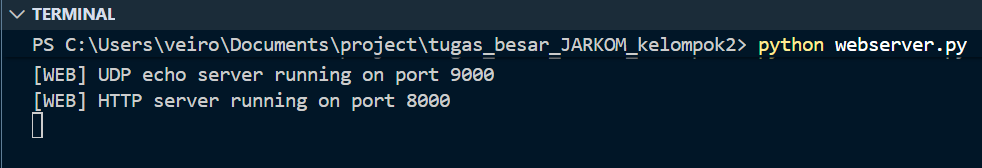
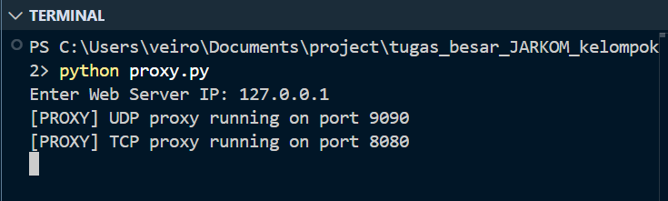
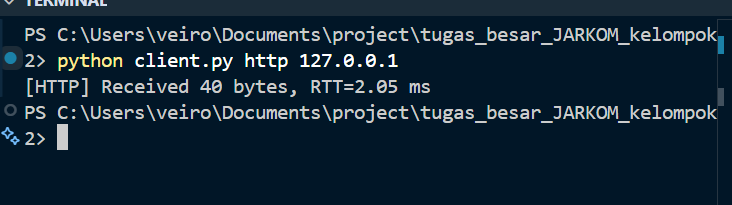
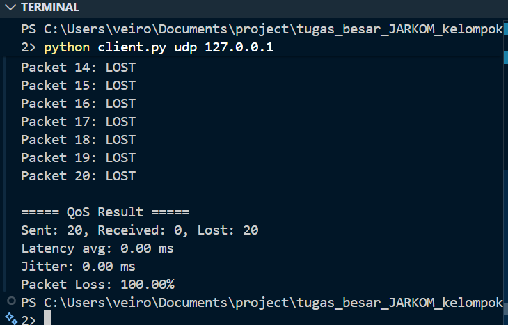
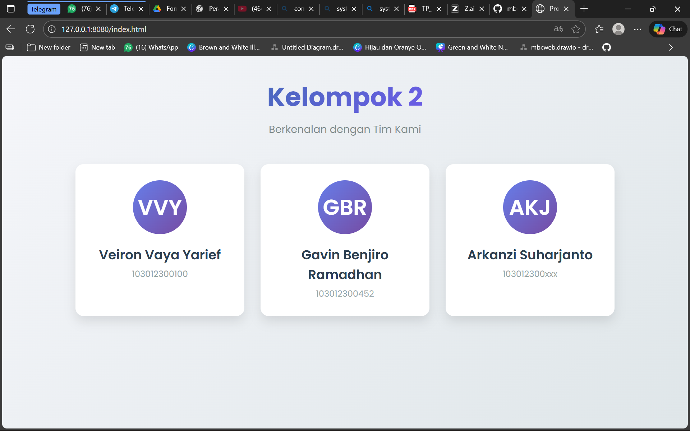

# KELOMPOK 2

# KELOMPOK 2

| NIM          | Nama                      |
|--------------|---------------------------|
| 103012300100 | Veiron Vaya Yarief        |
| 103012300452 | Gavin Benjiro Ramadhan    |
| 103012300xxx | Arkanzi Suharjanto        |


- [KELOMPOK 2](#kelompok-2)
  - [TES LOKAL](#tes-lokal)
    - [1. Jalankan webserver](#1-jalankan-webserver)
    - [2. Jalankan Proxy](#2-jalankan-proxy)
    - [3. Jalankan Client](#3-jalankan-client)
    - [4. Tes UDP QoS (Liat Wireshark)](#4-tes-udp-qos-liat-wireshark)
    - [5. Multi Client](#5-multi-client)
    - [6. Tes Browser](#6-tes-browser)
  - [TES SERIUS](#tes-serius)
    - [1. Setup jaringan](#1-setup-jaringan)
    - [2. Jalankan Proxy](#2-jalankan-proxy-1)
    - [3. Jalankan Client](#3-jalankan-client-1)
    - [4. TEST UDP QoS (Latency, Jitter, Packet Loss)](#4-test-udp-qos-latency-jitter-packet-loss)
    - [5. TEST MULTI-CLIENT (5 CLIENT SEKALIGUS)](#5-test-multi-client-5-client-sekaligus)
    - [6. TEST BROWSER MODE](#6-test-browser-mode)


## TES LOKAL

### 1. Jalankan webserver
- Terminal A `python webserver.py`


### 2. Jalankan Proxy
- Terminal B `python proxy.py`
- Masukkan IP `127.0.0.1`


### 3. Jalankan Client
- `python client.py http 127.0.0.1` 


### 4. Tes UDP QoS (Liat Wireshark)
- `python client.py udp 127.0.0.1`

- filter `tcp.port==8080 or tcp.port==8000 or udp.port==9090 or udp.port==9000`

### 5. Multi Client
- run- `python client.py http 127.0.0.1` di 5 terminal berbeda
- cek wireshark

### 6. Tes Browser
- Ke browser (edge,chrome dll)
- `http://127.0.0.1:8080/index.html`



## TES SERIUS
### 1. Setup jaringan

- Hubungkan ke 1 Wifi
- Tes IP pakai `ipconfig`
- Catat semua IP

### 2. Jalankan Proxy

- `python proxy.py --server-ip <IP-Web-Server>`
- Buka Wireshark filter `tcp.port == 8080 or tcp.port == 8000 or udp.port == 9090 or udp.port == 9000`

### 3. Jalankan Client

- `python client.py http <IP-Proxy>`
- Kalau berhasil `[HTTP] Received 350 bytes, RTT=25.33 ms`

### 4. TEST UDP QoS (Latency, Jitter, Packet Loss)

- `python client.py udp <IP-Proxy>`
- Wireshark akan ada:

```yml
Packet 1: RTT=12.4 ms
Packet 2: RTT=11.9 ms
Packet 3: LOST
...
===== QoS Result =====
Sent: 20, Received: 18, Lost: 2
Latency avg: 14.21 ms
Jitter: 1.33 ms
Packet Loss: 10.00%
```

### 5. TEST MULTI-CLIENT (5 CLIENT SEKALIGUS)
- Wireshark akan nangkap banyak koneksi pararel
- Lalu lintas padat QoS memburuk

### 6. TEST BROWSER MODE
- `http://192.168.43.20:8080/index.html`
- Jika Proxy dan Server benar maka, halaman HTML dari server muncul.

